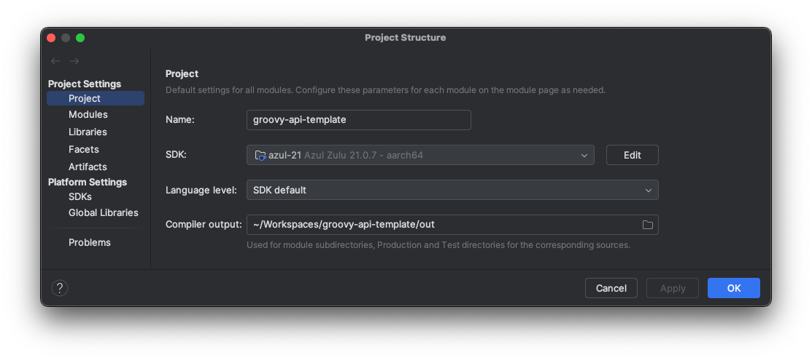
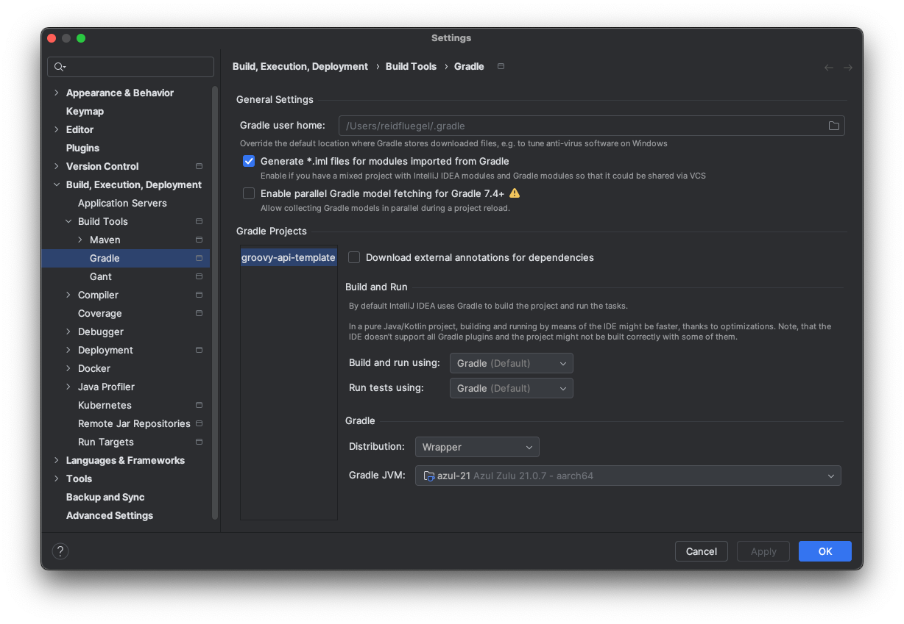

# Groovy Spring API Template
- This is a lightweight Groovy and Spring Boot API starter project that includes CI/CD, versioning, health checks, and PocketBase integration. Designed for quick deployment using Fly.io and GitHub Actions.
---
## Features
- Built with Groovy and Spring Boot
- Auto versioning using Axion Release Plugin
- `/heartbeat` endpoint with current version information
- `/health-check` endpoint that verifies connectivity to PocketBase
- Deployment via Fly.io
- GitHub Actions (GHA) for CI/CD and automated dependency updates
- Supports `.http` files for API testing
---
## Setup

- `brew install k6`
- Use latest version of Groovy 4.x.x if prompted
- Pocketbase is run separately (see [universal-pocketbase-api](https://github.com/Rfluegel1/universal-pocketbase-api))
- Set `pocketbase-base-url` and `POCKETBASE_ENV_PASSWORD` appropriately
- Run all behavioral tests `./gradlew clean build`
- Run all performance tests `./gradlew loadTest`
- Run the app `./gradlew bootRun`
---
## Testing
- Run all tests with `./gradlew clean build` or `./gradlew test` with optional environment `./gradlew test -Denvironment=local`
- .http files can be used for manual testing in IntelliJ
- Performance testing is supported via k6 `./gradlew loadTest`
- Functional tests (FTs) will test API E2E `./gradlew test --tests '*FT'`
- Unit tests will test classes with mocks when necessary `./gradlew test --tests '*Test'`
---
## Versioning
Versioning is managed by the Axion Release Plugin.
- Manged by GHA, so manual intervention should not be required
- `./gradlew currentVersion` to print the current version
- `./gradlew release` to tag and release a new version
---
## CI/CD
GitHub Actions is configured to:
- Run tests and validate builds on merges to main
- Create a new tag and use that as the version
- Deploys to staging env on successful ci build
- Automatically runs FTs against staging env after deploy
---
## Deployment
- Manged by GHA, so manual intervention should not be required
- Deploy using Fly.io with a valid fly.toml configuration. 
- Example command: `fly deploy`
---
## Dependency Updates
- Manged by GHA, so manual intervention should not be required
- To check for updates: `./gradlew dependencyUpdates`
---
## Environment Variables
The application relies on the following environment variables:
- `base.url` The url that the application will be reachable by
- `pocketbase-base-url` The url which the pocketbase instance will be reachable by
- `POCKETBASE_ENV_PASSWORD` The pocketbase password (assumes that fly env will use secret)
---
## Notes
- Versions during development will appear as `x.y.z-SNAPSHOT`, but the `/heartbeat` endpoint will automatically strip the `-SNAPSHOT` suffix for cleaner output.
---
## Author
**Reid Fluegel**  
[github.com/Rfluegel1](https://github.com/Rfluegel1)  
[reidfluegel.fly.dev](https://reidfluegel.fly.dev/)
---
## License
This project is licensed under the [MIT License](LICENSE).
